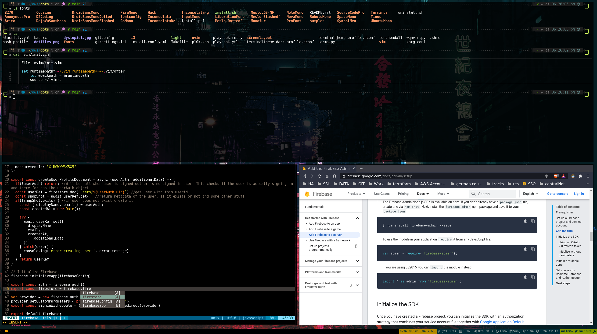
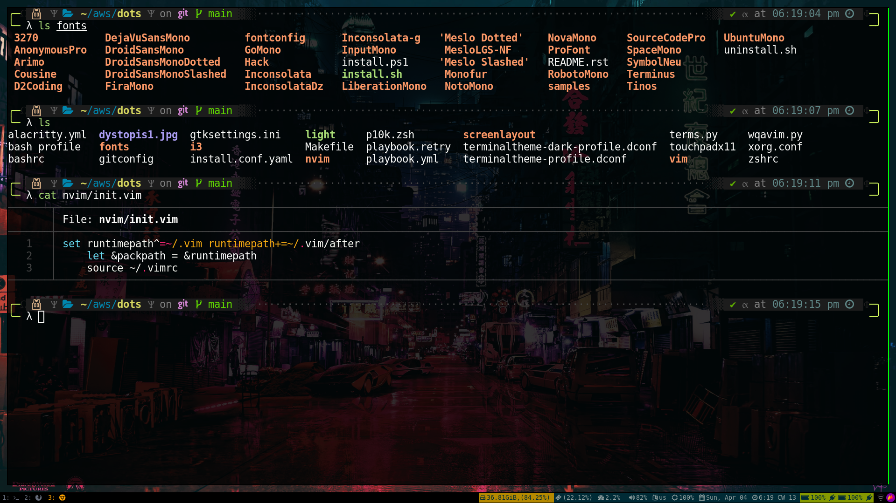

# Dotfiles

- This repo contains all the files necessary to set up a workstation.
- The set up is mainly done by ansible and [DotBot](https://github.com/anishathalye/dotbot).
- Run the make commands below to get started. :)

## Installation

- To set up our workstation we must first execute `sudo make setup`.
  This will install ansible and necessary packages to run the main ansible `playbook`.
- Once done, we can then run `make init`. Provide your sudo password.
  > This is needed the for the first time.
- Now run `make run`
  This will run the main ansible `playbook.yml` that will setup the work station.
  > `make check` can also be run which will run the ansible playbook in checkmode.
- When the playbook has run to completion.
  - Reboot your system.
  - Log in (but this time click on the setting button next to the login button and select `i3`)
  - Open the terminal `Alt+Enter` and walaah!!

The workstation should look something like this when done.

# Command Reference

| Command       |                                                                                     Desciption |
| ------------- | ---------------------------------------------------------------------------------------------: |
| `make setup`  |                                     Bootstraps the packages required to run the main playbook. |
| `make init`   |                                                 Sets up proper sudo access for the first time. |
| `make run`    |                                    Executes the main ansible playbook and installs everything. |
| `make check`  |                                                         Runs the main playbooks in check mode. |
| `make tag`    | Runs the main playbook with a specific tags. make tag tags="<one or comma sep. multiple tags>" |
| `make update` |                                          Runs the main playbook to only update the workstation |

# Credits

- [zsh](https://www.zsh.org/)
- [oh-my-zsh](https://github.com/ohmyzsh/ohmyzsh)
- [Powerlevel10k](https://github.com/romkatv/powerlevel10k)
- [zsh-users](https://github.com/zsh-users)
- [DotBot](https://github.com/anishathalye/dotbot)
- [Alacritty](https://github.com/alacritty/alacritty)
- [NVM](https://github.com/nvm-sh/nvm)
- [Brave Browser](https://brave.com/)
- [VScode](https://code.visualstudio.com/)
- [Neovim](https://github.com/neovim/neovim)
- [i3gaps](https://github.com/Airblader/i3)

And also a large number of vim plugins and third party packages. Thankyou for the awesome OS projects.

## Considerations

- Currently this repo is fully compatible with Ubuntu 18.04 and 20.04.
- The playbook will set everything up for the user who is running the playbook. Basically for the $(whoami) user.
- [DotBot](https://github.com/anishathalye/dotbot) is used to connect the actual dotfiles.
- Deoplete may require running `:UpdateRemotePlugins` the first time.
- If `zsh` doesn't start, we have to manully `chsh -s $(which zsh)` as well in some case.
